# Relational Database Resilience

## Screenshot of successfully created VPCs in two different AWS regions

primary_Vpc.png
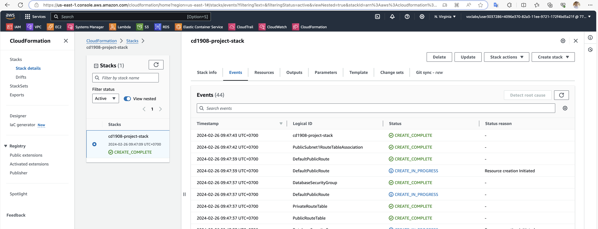

secondary_Vpc.png
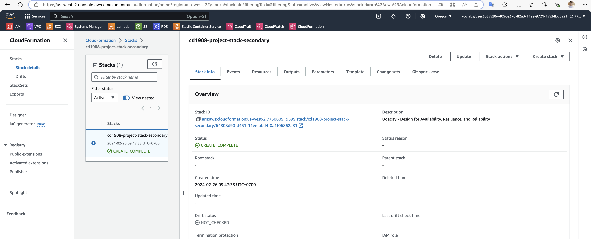

## Highly durable RDS Database

primaryDB_config.png
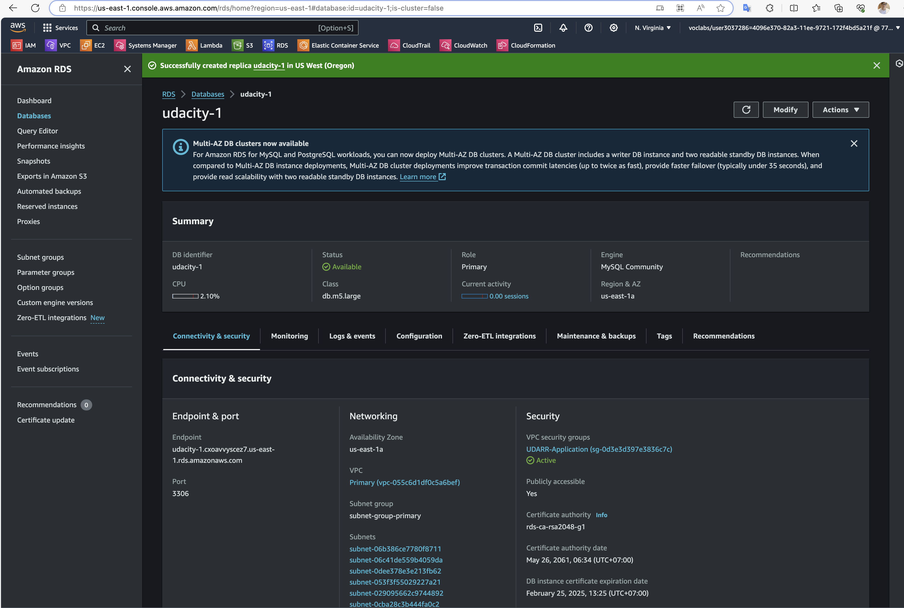

secondaryDB_config.png
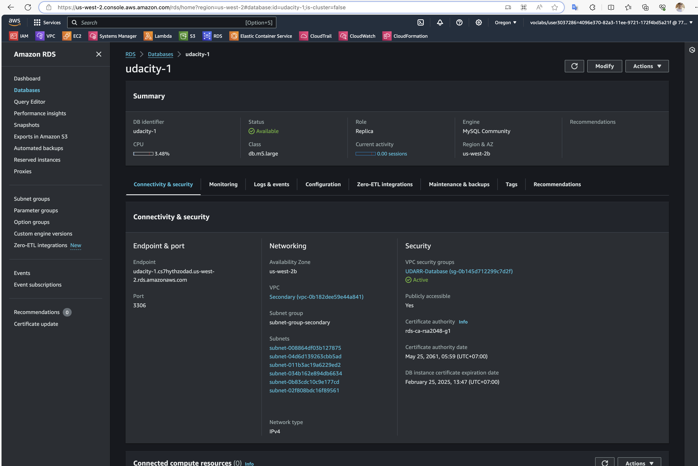

primaryDB_subnetgroup.png
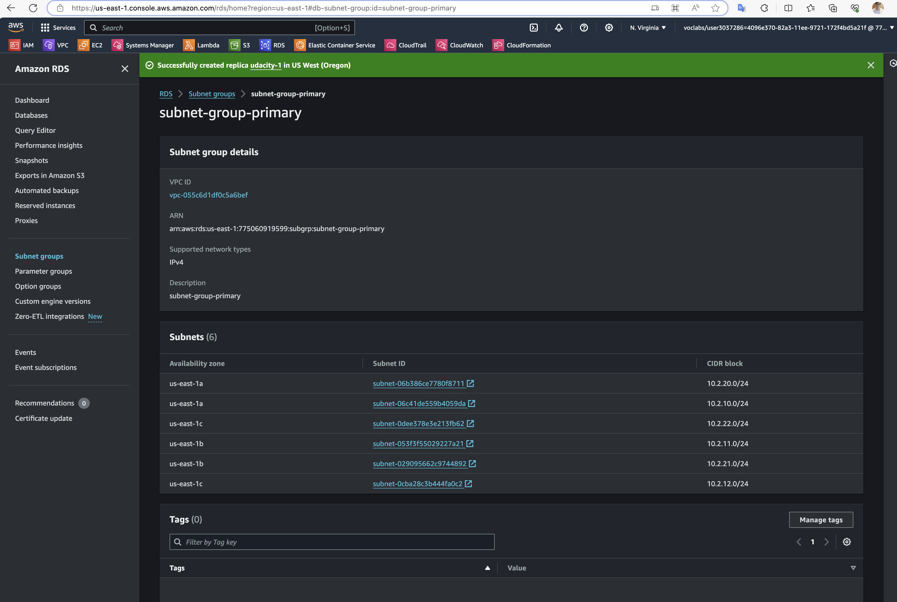

secondaryDB_subnetgroup.png
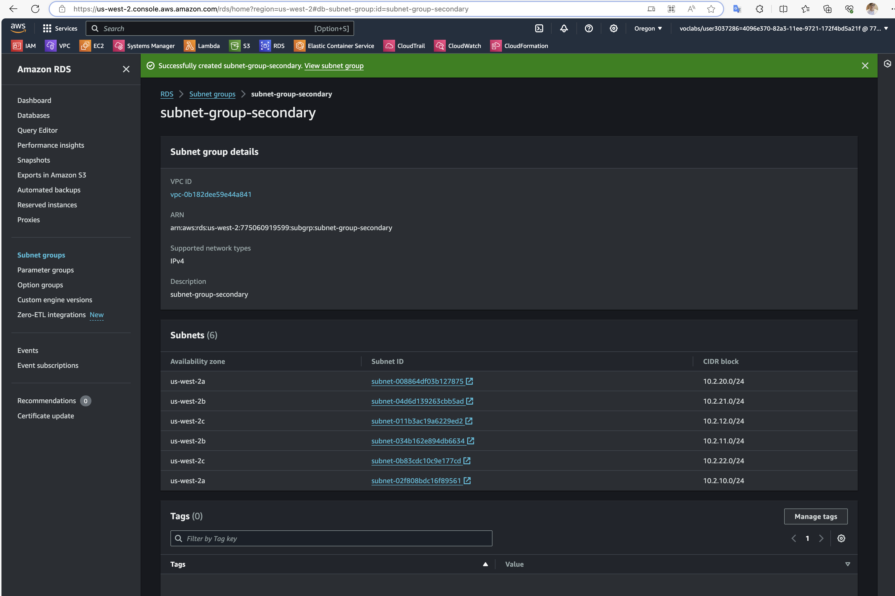

primaryDB_subnets.png
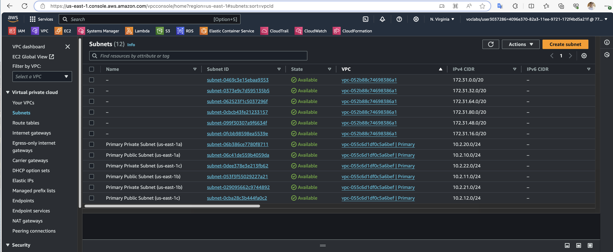

secondaryDB_subnets.png
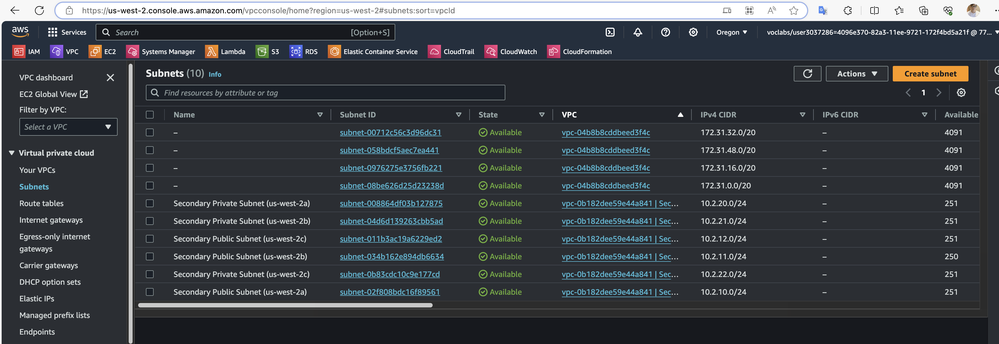

primaryDB_subnet_routing.png
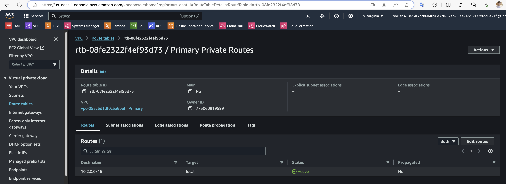

secondaryDB_subnet_routing.png
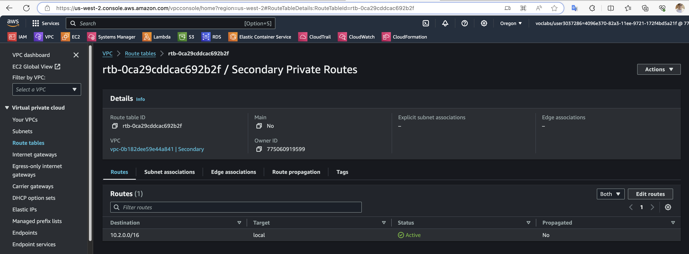

## Availability Estimate

estimate.txt

## Demonstrate normal usage
log_primary.txt

## Monitor database
monitoring_connection.png
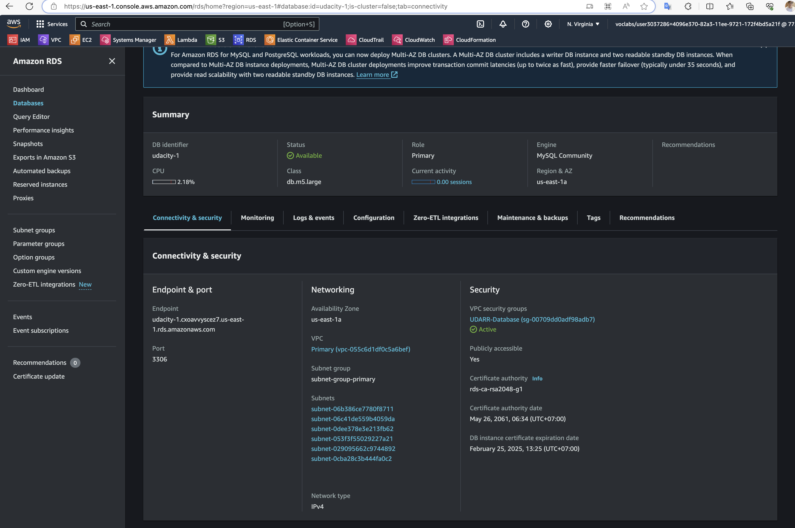

monitoring_replication.png
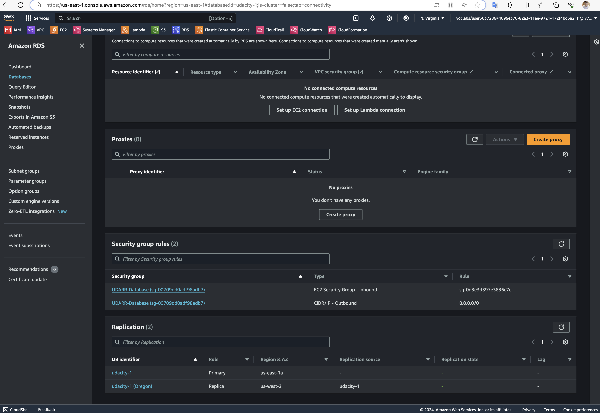

## Website Resiliency

s3_original.png

s3_season.png

s3_season_revert.png

s3_deletion.png
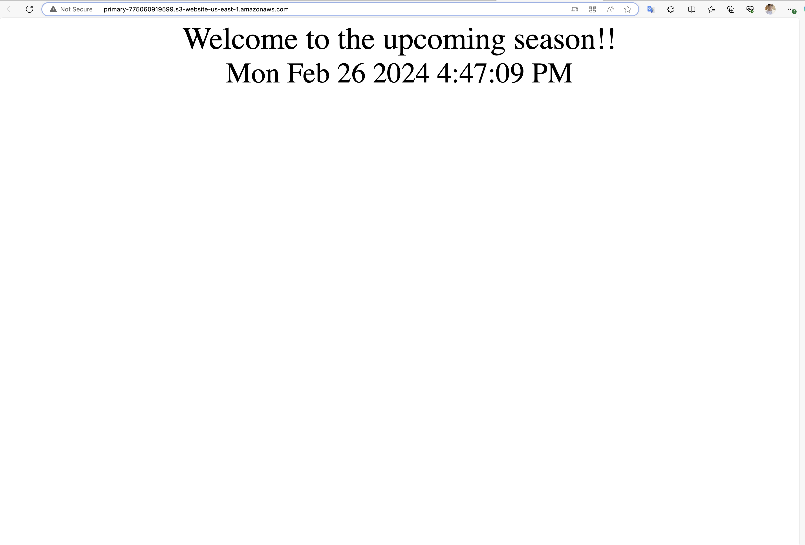

s3_delete_maker.png
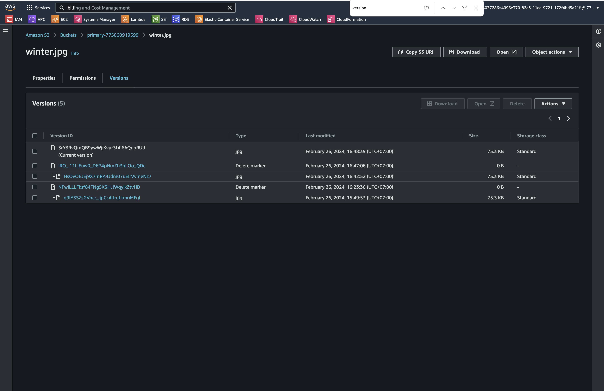

s3_delete_revert.png

